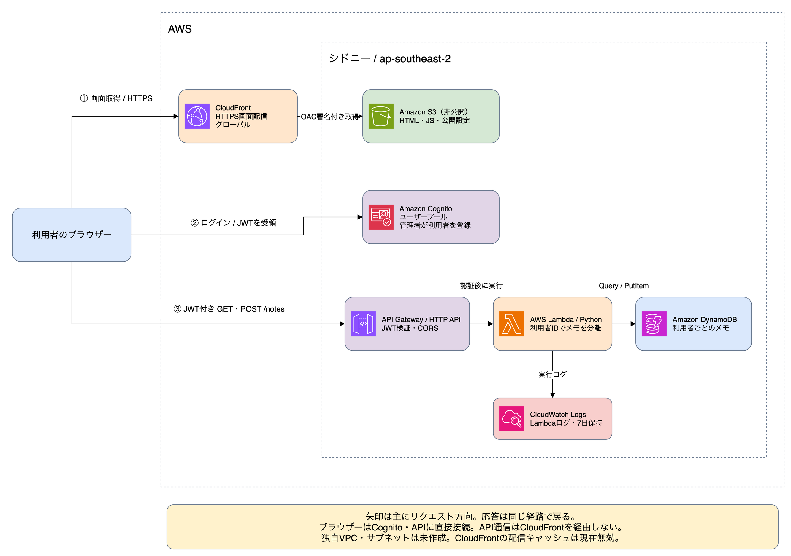
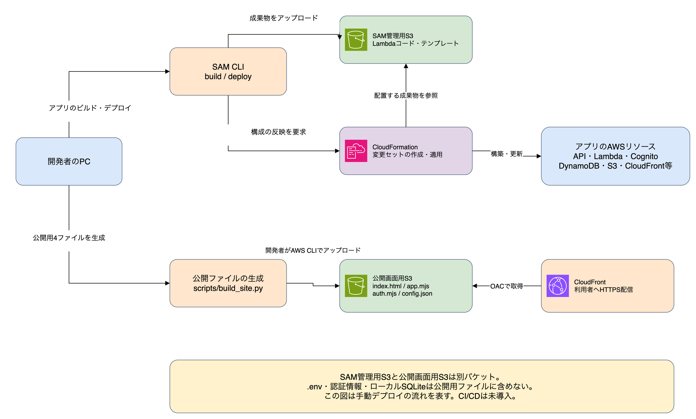

# Infra Notes — AWSインフラ学習ラボ

メモの登録・一覧表示だけを行う小さなWebアプリです。アプリを題材として固定し、環境の再現性、認証、監視、障害対応、性能、費用を段階的に学びます。

## 最初に動かす

Python 3.10以上で、追加ライブラリなしでローカル動作します。

ターミナルで、このプロジェクトのルートフォルダー（`local.py` がある場所）を開いて実行します。

```sh
python3 local.py
```

ブラウザで http://127.0.0.1:8080 を開きます。停止は Ctrl+C。メモは `local.sqlite3` に保存され、再起動しても残ります。ローカル版は固定ユーザーを使う開発専用で、127.0.0.1だけで待ち受けます。

```sh
python3 -m unittest discover -s backend/tests -v
python3 -m unittest discover -s tests -v
```

## ソースコードの配置

同じリポジトリ内でフロントエンドとバックエンドを分けています。

```text
aws-infra-lab/
├── frontend/          # HTML・JavaScript
│   └── tests/         # 認証・画面のテスト
├── backend/
│   ├── app/           # Lambdaの処理
│   └── tests/         # API処理のテスト
├── tests/             # 公開設定・サイト生成の共通テスト
├── template.yaml      # 共通のAWS構成
├── scripts/           # 公開ファイル生成など
├── local.py           # ローカル開発サーバー
├── login.py           # CLIログイン用の補助ツール
└── docs/              # 起動・デプロイ手順
```

以下のコマンドはすべてリポジトリのルートから実行します。

```sh
python3 -m unittest discover -s backend/tests -v
python3 -m unittest discover -s tests -v
node --test frontend/tests/*.test.mjs
```

ローカルサーバーは `frontend/` の画面を配信します。公開用ビルドは `python3 scripts/build_site.py` で、従来どおり `dist/` に4ファイルだけを生成します。フロントエンドのテストは公開されません。SAMは `backend/app/` をLambdaのコードとして扱い、バックエンドのテストもデプロイ対象に含めません。

フロントエンドの更新は公開ファイルの生成・S3へのアップロード、バックエンドの更新は `sam build`・`sam deploy` で反映します。ディレクトリ整理後は、次回のバックエンド反映前に `sam build` を再実行してください。

## 構成

| 項目 | ローカル | AWS |
|---|---|---|
| 画面 | PythonからHTMLを配信 | CloudFront + 非公開S3（公開準備済み） |
| API | Python HTTPServer | API Gateway HTTP API → Lambda |
| 認証 | 固定の開発ユーザー | Cognito → API Gateway JWT認証 |
| データ | SQLite | DynamoDB |
| 環境定義 | Pythonの起動 | AWS SAM / CloudFormation |

AWSではブラウザから送られたユーザーIDを信用せず、API Gatewayが検証したJWTの `sub` をデータの所有者にします。Lambdaの権限は対象テーブルのQuery・PutItemに限定しています。ユーザー名・パスワードを入力するログイン画面を用意しています。初回パスワード変更にも対応しています。操作方法は [ログイン画面](docs/03-login-screen.md) を参照してください。

## なぜSAMか

最初はAWS SAMを選びました。API・Lambda・認証・テーブルを一つのファイルで読み、サーバーレスの接続関係を追いやすくするためです。Terraformは必須ではありません。後で同じ構成をTerraformで表現する比較演習もできます。

## 実装状況と制約

- 作成済み：ローカルアプリ、共通API処理、SAM構成、単体テスト、学習手順。
- 確認済み：既存APIスタックのデプロイ。ローカル画面からのログイン・メモ保存は利用者が確認。
- 未検証：CloudFront公開画面での実動作。単体テストでAWSの動作を保証するものではありません。
- 未実装：S3添付、CI/CD、アラーム、復元、負荷試験。
- 一覧は最新50件のみ。ページングや編集・削除は当面対象外。
- 学習用スタックは削除時にテーブル・ユーザープールも削除されます。実データを入れないでください。
- Lambdaのboto3はランタイム同梱版を使用。依存の固定・パッケージ化は再現性の改善課題です。

AWSへの構築方法は [AWSデプロイ手順](docs/02-aws.md) を参照してください。学習計画・演習・学習実績は、このリポジトリの親にある `aws/` ディレクトリで管理します。

## 公式資料

- [SAMのJWT認証](https://docs.aws.amazon.com/serverless-application-model/latest/developerguide/serverless-controlling-access-to-apis-oauth2-authorizer.html)
- [SAM CLIのインストール](https://docs.aws.amazon.com/serverless-application-model/latest/developerguide/install-sam-cli.html)
- [Lambda Pythonランタイム](https://docs.aws.amazon.com/lambda/latest/dg/lambda-python.html)

画面のインターネット公開は [AWS公開手順](docs/04-publish.md) を参照してください。

## AWS構成図

[編集用の構成図](docs/diagrams/architecture.drawio) はdraw.io形式です。ブラウザー版の「ファイル → 開く → デバイス」から開けます。

### 利用時の構成



### 構築・更新の流れ



構成を変更したら `template.yaml` と合わせて図も更新してください。図には実際のアカウントID・公開URL・バケット名を記載していません。

構成図のAWSサービスにはdraw.io内蔵のAWSアイコンを使用しています。サービス名・役割と併せて編集できます。

図を編集したら、draw.ioの「ファイル → 形式を指定してエクスポート → PNG」で各ページを画像に書き出し、上記2枚も更新してください。編集元と画像を一緒にコミットすると、GitHubのREADMEから構成図を閲覧できます。

## アカウント作成

ユーザー名・メールアドレス・パスワードで登録し、メールの確認コードを入力する画面を追加しています。確認コードの再送にも対応します。既存ユーザーは従来どおりログインできます。

AWSへの反映と実機確認は未実施です。[反映・確認手順](docs/05-signup.md)を参照してください。
